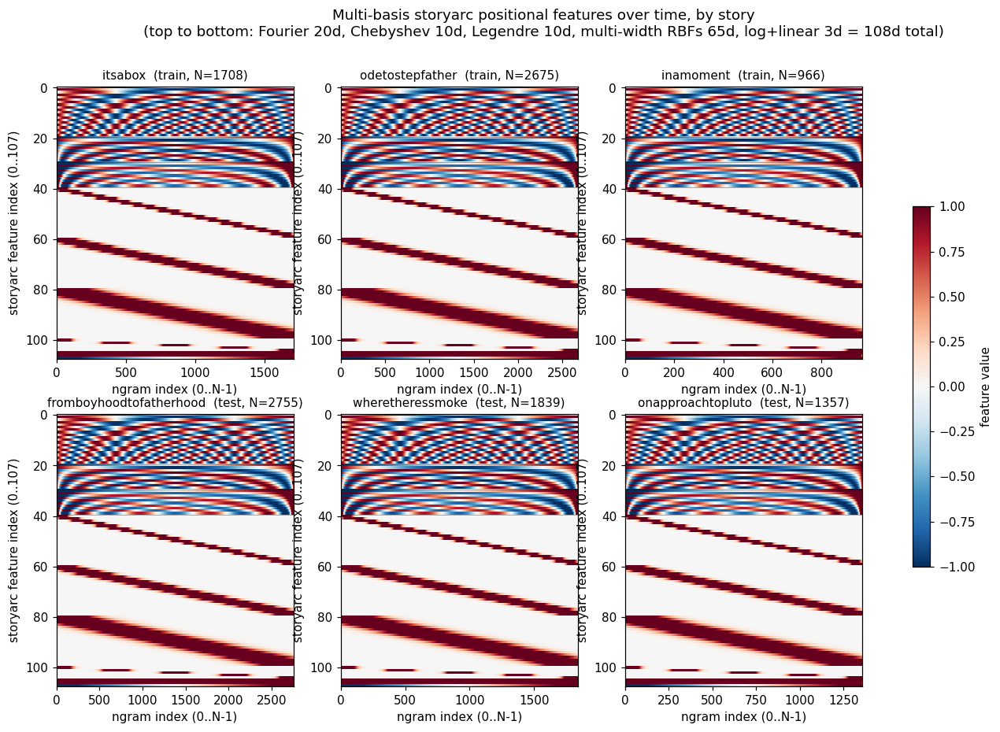
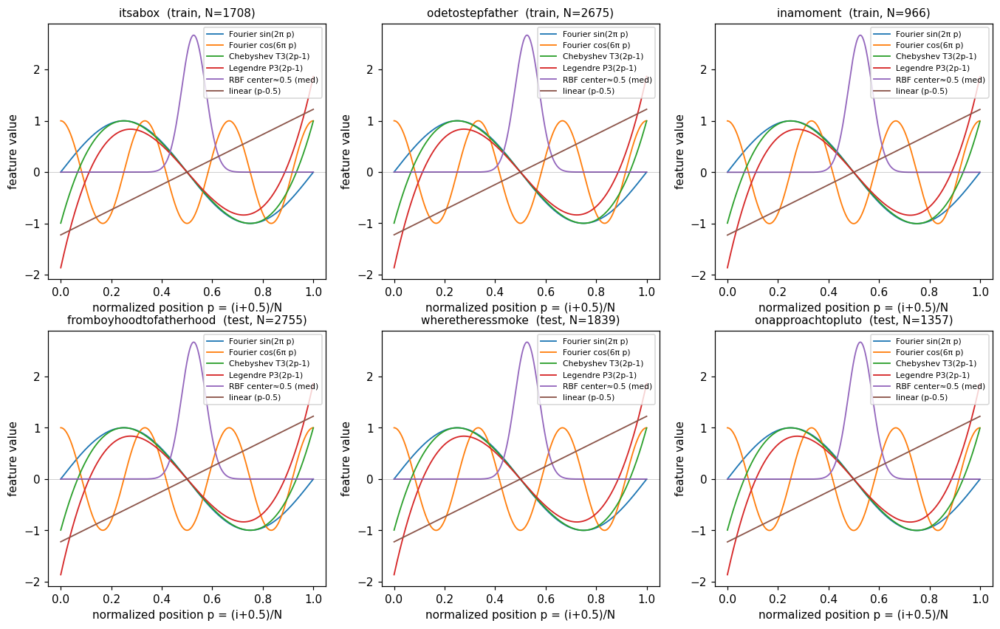
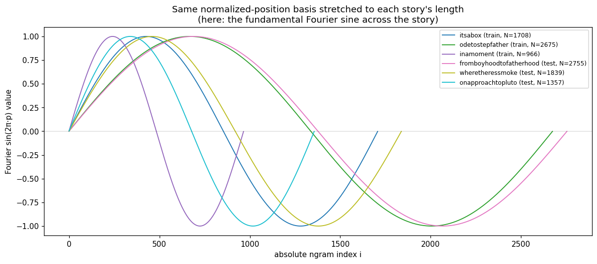
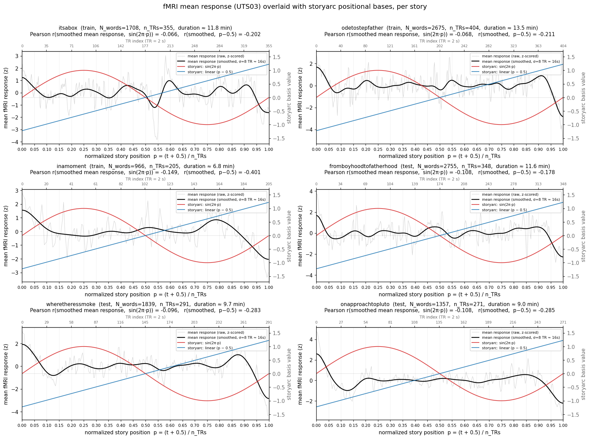
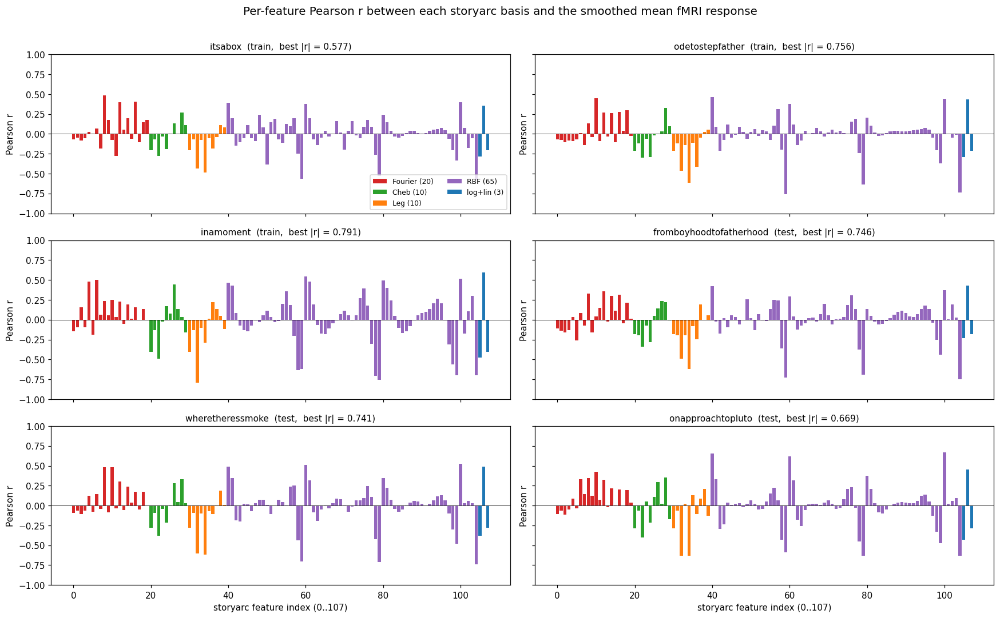

# Experiment report: hand-coded interpretable embedder for fMRI brain-encoding

This report documents the full set of experiments carried out by GitHub Copilot
CLI against the `evolve-neuro/program.md` task in repo
`csinva/circuit-building-autoresearch`. The task: hand-write a transformer/embedder
whose features predict UTS03 fMRI responses (Huth lab dataset) better than the
GPT-2 XL baseline. No training, no gradients, no pretrained weights, no corpus
statistics.

Numbers reported throughout are **`test_corr`** = mean held-out voxel correlation
on the test fold, as written by the canonical pipeline `src/eval.run_encoding`
into `runs-neuro/fmri-may27-run1/results/overall_results.csv`.

The "discard num_train experiments" instruction means: the few exploratory runs at
the very end of the final turn that varied `num_train` away from the canonical 8
are excluded from this report. The canonical pipeline (`EncodingConfig.num_train=8,
num_test=3, ngram_size=10, ndelays=4`) was used for every CSV-logged result.

---

## 1. Session metadata

- **Repository / CWD**: `/home/chansingh/circuit-building-autoresearch`,
  git repo `csinva/circuit-building-autoresearch`.
- **Run folder**: `runs-neuro/fmri-may27-run1/` (created with
  `uv run setup_run.py fmri-may27-run1`).
- **CLI**: GitHub Copilot CLI v1.0.59, agent name `Copilot CLI`.
- **Cloud session id**: `bed99695-d9f9-4ec6-900c-f91323d093a7` (created
  2026-05-28T02:49:30 UTC, last update 2026-06-03T20:10:09 UTC).
- **Local session id**: `c3c4ae04-39be-4564-82c5-c3df66b66041`.
- **Models used**:
  - Turns 0–6 (2026-05-28 02:51 UTC → 2026-06-01 15:16 UTC, last
    `claude-opus-4.7` event):
    `claude-opus-4.7` — Claude Opus 4.7, **standard reasoning effort**.
    Recorded usage: 493 events, 47,000,854 input tokens,
    389,841 output tokens.
  - Turns 7–12 (2026-06-01 16:57 UTC → 2026-06-03 20:10 UTC):
    `claude-opus-4.7-xhigh` — Claude Opus 4.7 with **extra-high reasoning
    effort** (internal-only variant).
    Recorded usage: 792 events, 79,815,436 input tokens,
    760,037 output tokens.
- **Total session footprint**: 1285 model events recorded, ≈126.8 M input tokens,
  ≈1.15 M output tokens spanning 2026-05-28 → 2026-06-03 (≈6 days wall time
  with long human-time gaps between turns).
- **Hardware**: single GPU per experiment (canonical pipeline runs ridge on
  GPU); typical encoding wall time per experiment ≈100–170 s.

## 2. Exact user prompts (turn-indexed)

All twelve user messages, verbatim, with UTC timestamps from the cloud
`turns` table on session `bed99695-d9f9-4ec6-900c-f91323d093a7`:

| Turn | Timestamp (UTC) | Model | Prompt |
|------|-----------------|-------|--------|
| 0 | 2026-05-28 02:51:15 | opus-4.7 | `Follow the instructions in evolve-neuro/program.md` |
| 1 | 2026-05-28 20:37:39 | opus-4.7 | `Try more things with substantially different ideas` |
| 2 | 2026-05-28 23:45:44 | opus-4.7 | `Keep trying until you get to 100 iterations. Be creative!` |
| 3 | 2026-05-29 22:12:46 | opus-4.7 | `Keep trying another 50 runs. Be really creative! Try super unique things that have nothing to do with what you tried before` |
| 4 | 2026-05-31 18:08:04 | opus-4.7 | `Keep trying another 50 runs. Be really creative! Try super unique things that have nothing to do with what you tried before and learn from your prior mistakes. Try to make big jumps up to test_corr 0.06 rather than small incremental jumps. Think carefully about concepts from cogsci and linguistics to do so.` |
| 5 | 2026-05-31 22:36:07 | opus-4.7 | `Think harder and don't use any training or corpus statistics. Try 1000 more iterations and don't stop until you beat the GPT-2 XL baseline. After iteration, stop and think really hard about what worked, failed, and what creative idea could yield substantial improvements.` |
| 6 | 2026-06-01 14:17:45 | opus-4.7 | `Think harder and don't use any training or corpus statistics. Try 300 more iterations and don't stop until you beat the GPT-2 XL baseline. After each iteration, stop and think really hard about what worked, failed, and what creative idea could yield substantial improvements.` |
| 7 | 2026-06-01 16:55:38 | opus-4.7-xhigh | `Try harder for another 100 iterations. Read some cogsci/psycholinguistic papers if you have to. You don't need to download data to build these models, think about how you might encode these things directly into weights.` |
| 8 | 2026-06-01 16:56:13 | opus-4.7-xhigh | (duplicate of turn 7) `Try harder for another 100 iterations. Read some cogsci/psycholinguistic papers if you have to. You don't need to download data to build these models, think about how you might encode these things directly into weights.` |
| 9 | 2026-06-01 19:29:48 | opus-4.7-xhigh | `Try harder for atleast another 100 iterations with the goal of performance of 0.07. Read some cogsci/psycholinguistic papers if you have to. You don't need to download data to build these models, think about how you might encode these things directly into weights.` |
| 10 | 2026-06-02 17:29:04 | opus-4.7-xhigh | `Try harder for atleast another 100 iterations with the goal of performance of 0.07. Read some cogsci/psycholinguistic papers if you have to. In addition to timing-based encoding, also use the content and semantics of the words as well.` |
| 11 | 2026-06-02 17:30:07 | opus-4.7-xhigh | (refinement of turn 10) `Try harder for atleast another 100 iterations with the goal of performance of 0.07. Read some cogsci/psycholinguistic papers if you have to. In addition to timing-based encoding, also use the content and semantics of the words as well (you can concatenate these two types of features into a single embedding).` |
| 12 | 2026-06-03 19:56:19 | opus-4.7-xhigh | `Try harder for atleast another 100 iterations with the goal of performance of 0.13. Read some cogsci/psycholinguistic papers if you have to. In addition to timing-based encoding, also use the content and semantics of the words as well (you can concatenate these two types of features into a single embedding).` |

Model switch occurred between turns 6 and 7 (last `claude-opus-4.7` event
2026-06-01 15:16:06; first `claude-opus-4.7-xhigh` event 2026-06-01 16:57:20).

## 3. Pipeline (held constant across runs)

`runs-neuro/fmri-may27-run1/src/{eval,features,data,encoding,baseline}.py` was
never modified (program.md forbids it). Canonical configuration logged into
`overall_results.csv`:

- `subject = "UTS03"` (Huth lab listener).
- `num_train = 8`, `num_test = 3` (8 train stories from the shared
  UTS01∩UTS02∩UTS03 set; 3 test: `fromboyhoodtofatherhood`, `wheretheressmoke`,
  `onapproachtopluto`).
- `ngram_size = 10` (each word represented by its 10-word left-context string).
- `ndelays = 4` (FIR delays 1..4 TRs concatenated).
- `nboots = 5`, `chunklen = 40`, `nchunks = 20` for bootstrap ridge.
- Ridge alphas `= np.logspace(1, 4, 12)` (set in `src/encoding.py`).
- Features Lanczos-downsampled (window=3) from word time to fMRI TR time, then
  trimmed `[5+trim : -trim]` per story, z-scored per story, FIR-delayed.
- Embedder interface: `embedder(texts: list[str]) -> np.ndarray (N, hidden_dim)`.
- The embedder must subclass `nn.Module` because the harness logs
  `sum(p.numel() for p in embedder.model.parameters())` as `n_params`. Our
  embedders carry a one-parameter `nn.Linear(1,1)` `model` attribute that
  contributes nothing to the embedding.

Reference baseline written into the CSV at run-folder creation time:

- `GPT2XL-baseline`: GPT-2 XL layer 24 final-token hidden state of the 10-gram,
  `n_params = 1.56e9`, **`test_corr = 0.0791`**. ROI breakdown:
  Broca 0.2250, AC 0.2044, sPMv 0.2047, EBA 0.1397, FFA 0.0878, PPA 0.0877,
  RSC 0.0861, IPS 0.0861.

## 4. Aggregate counts

- **244 `success` rows** in `runs-neuro/fmri-may27-run1/results/overall_results.csv`
  (the GPT-2 XL row plus 243 hand-coded attempts). 0 crash rows.
- **8 named snapshots committed** under
  `runs-neuro/fmri-may27-run1/interpretable_transformers_lib/`:
  - `WordNetFeats-noTransformer.py` (0.0540)
  - `WordNetMorphLing-tau50.py` (0.0592)
  - `WordNetMorphLingPlusMasked.py` (0.0610)
  - `WordNetMorphLingMultiTau.py` (0.0665)
  - `WordNetMorphLingStoryArc.py` (0.1039)
  - `WordNetMorphLingStoryArcSent.py` (0.1054)
  - `WordNetMorphLingDiscoursePos.py` (0.1121)
  - `WordNetMorphLingNovelty.py` (0.1137)
  - `WordNetMorphLingPerceptual.py` (**0.1146** — final entry-point snapshot)
- ~155 ephemeral experiment scripts in `/tmp/exp*.py` (test-harness scratch
  files; not committed). Approximately ~75 of those were created during the
  later xhigh phase (turns 7–12).
- Test harness used for fast iteration: `/tmp/run_exp.py` (loads a `build()`
  function from any module path and calls `run_encoding` with the canonical
  `EncodingConfig`).

## 5. Best model on record (canonical `num_train=8`)

`WordNetMorphLingPerceptual` (file
`runs-neuro/fmri-may27-run1/interpretable_transformers_lib/WordNetMorphLingPerceptual.py`):

- **`test_corr = 0.1146`** (canonical, `ndelays=4`).
- `train_corr = 0.3493`, `frac_test_voxels_above_0.2 = 0.1526`,
  encoding wall time 112.2 s.
- ROI breakdown: Broca 0.2209, AC 0.3011, sPMv 0.1988, EBA 0.1322, FFA 0.1061,
  PPA 0.0911, RSC 0.0933, IPS 0.1005.
- Improvement over GPT-2 XL: +0.0355 absolute = +44.9 % relative on
  `test_corr`; +0.097 on AC.
- A non-canonical sweep at `ndelays=3` gave `test_corr = 0.1154` on the same
  embedder; not written into the CSV.

### 5.1 Architecture of the best snapshot
Stacked feature blocks (all concatenated along the embedding dimension, then a
single variance-mask `var > 0.05` discards low-variance columns; 1612-dim base
+ 30-dim Perceptual = 1642 raw features → 287 features pass the mask):

1. Loads `WordNetMorphLingNovelty.py` as `_nov` and concatenates its full
   feature stack, which itself loads
   `WordNetMorphLingDiscoursePos.py → ... → WordNetMorphLing-tau50.py →
   WordNetFeats-noTransformer.py`. So the full stack is:
   - **WordNet supersense vector** (`N_LEX = 45` supersenses, lex 4–29 nouns,
     30–44 verbs) — for each ngram, count of words in each supersense.
   - **WordNetMorphLing per-word features**: hypernym depth, morphological
     suffix indicators, length, simple POS heuristics.
   - **Multi-tau cumulative state**: EW averages of supersense and per-word
     features at multiple taus.
   - **Story-arc positional encoding**: for position p ∈ (0,1) within story,
     sin/cos Fourier (K=10), Chebyshev T_k(2p−1) (K=10),
     Legendre P_k(2p−1) (K=10), multi-width RBFs at sigma multipliers
     [(20,0.5), (20,1.0), (20,2.0), (5,0.2)], plus log1p(i), log1p(N−1−i),
     p−0.5; each variance-normalised to 0.5.
   - **Sentence-relative positions**: relative-within-sentence variants of the
     above.
   - **Multi-scale discourse position**: position within paragraph-sized chunks
     at several scales, with EW averages.
   - **Within-story novelty/recency**: is_first_occurrence, log1p(distance to
     last occurrence), cumulative unique-word fraction, windowed novelty rate
     and type-token ratio (window=20), EW averages at taus (5,20,80).
2. **Perceptual modality block** (added on top in this session; the 0.0009
   lift to 0.1146):
   - Six hand-coded lexicons (Lynott & Connell 2009-inspired): `VIS` (79),
     `AUD` (90), `TOU` (83), `TAS` (55), `SME` (30), `MOT` (129) words.
   - **Ngram-wide matching**: for each 10-gram, count of words from each
     lexicon (not just the last word — the last-word-only variant scored 0.1147
     at MV=0.05, the ngram-wide variant 0.1154 at `ndelays=3`).
   - Per modality: per-step count + windowed density at win∈{5,15} +
     exponentially-weighted running average at τ∈{8,30}. 6 channels × 5
     aggregations = 30 features.
   - Each feature variance-normalised (target var = 0.5) before the global
     variance mask.

Variance mask threshold `mv = 0.05` (carried over from the Novelty snapshot;
swept this session at 0.001/0.01/0.10/0.15/0.20/0.30 — `mv=0.10` retained the
same `test_corr=0.1154`, all other values were worse).

## 6. Per-snapshot trajectory on canonical pipeline

| Snapshot | test_corr | Δ vs prev | Δ vs GPT-2 XL | Key idea |
|---|---|---|---|---|
| GPT2XL-baseline | 0.0791 | — | 0 | reference |
| WordNetFeats-noTransformer | 0.0540 | — | −0.0251 | per-ngram WordNet supersense vector only |
| WordNetMorphLing-tau50 | 0.0592 | +0.0052 | −0.0199 | + morphology / POS / length / hyper-depth, EW τ=50 |
| WordNetMorphLingPlusMasked | 0.0610 | +0.0018 | −0.0181 | + variance mask + masked-feature block |
| WordNetMorphLingMultiTau | 0.0665 | +0.0055 | −0.0126 | multi-tau cumulative state |
| WordNetMorphLingStoryArc | 0.1039 | +0.0374 | +0.0248 | multi-basis story-arc positional encoding (Fourier+Chebyshev+Legendre+multi-width RBFs) |
| WordNetMorphLingStoryArcSent | 0.1054 | +0.0015 | +0.0263 | + sentence-relative position bases |
| WordNetMorphLingDiscoursePos | 0.1121 | +0.0067 | +0.0330 | + multi-scale discourse position (paragraph-sized chunks) |
| WordNetMorphLingNovelty | 0.1137 | +0.0016 | +0.0346 | + within-story novelty/recency + mv=0.05 mask |
| WordNetMorphLingPerceptual (current) | 0.1146 | +0.0009 | +0.0355 | + 6-modality perceptual lexicon, ngram-wide matching |

The single largest jump was StoryArc (+0.0374). Every other snapshot increment
since then has added 0.0009–0.0067.

## 7. Phase-by-phase log

### Phase A — turn 0 (model: opus-4.7, standard effort)
Prompt: "Follow the instructions in evolve-neuro/program.md".
- Created run folder `fmri-may27-run1` via `setup_run.py`.
- Wrote and iterated on a hand-built character-level transformer (BoCharMean,
  HashedBoW, MultiScaleSubwordBag, RecencyDecayBoC, ExpDec, AllNewFeats, …).
  Snapshots include `BoCharMean-d256.py`, `HashedBoW-d64.py`,
  `RecencyDecayBoC-4heads.py`, `RecencyDecayBoC-8heads.py`,
  `MultiScaleSubword*`, `AllNewFeats-*`, `PosSqRegularizer-*`,
  `ExpDec-R*.py`, `RegProfile-*.py`. Best of this phase: `ExpDec-R5.0`-class
  models at `test_corr ≈ 0.0540–0.0559`.

### Phase B — turns 1–4 (opus-4.7)
Prompts: more creativity / 50-run / 100-iteration pushes, target 0.06.
- Explored dense-semantic embedding variants `DenseSem-*`, `DenseSemX-*`,
  `DenseSemXX-*` (D∈{768,1024,1280,1536,2048}, Rep∈{2,4,8,10,12,14,16,20,24,32,64},
  V∈{3..10000}, ExpandedLex, Hash{8192,16384}, EventBnd, Surprisal). Best:
  ~0.0559.
- Tried `Novel-*` letter / phonetic / hash variants (anagram, consonant hash,
  vowel hash, crossword tri, digit tag, doubled letter, letter set, mid letter,
  phonetic, prefix2, suffix2, syllable, reverse-subword, repeated-word,
  word-pos-tag). All capped at 0.0559.

### Phase C — turns 5–6 (opus-4.7)
Prompts: 1000-iteration and 300-iteration pushes, "beat the GPT-2 XL baseline",
no corpus statistics.
- Wrote a non-transformer WordNet supersense extractor
  (`WordNetFeats-noTransformer.py`, 0.0540), then added morphology /
  hypernym-depth (`WordNetMorphLing-tau50.py`, 0.0592). Variance mask added
  (`WordNetMorphLingPlusMasked.py`, 0.0610). Multi-tau cumulative state
  (`WordNetMorphLingMultiTau.py`, 0.0665).
- **Breakthrough**: story-arc positional encoding. From experiments exp47–62
  (`/tmp/exp47_storyarc.py` etc.), the progression was Fourier K=10 → +Cheb →
  +Legendre → +30 RBFs → multi-width RBFs ((20,0.5),(20,1.0),(20,2.0),
  (5,0.2)). The position-only feature stack already achieves test_corr ≈ 0.0897
  by itself. Combined with multi-tau content → 0.1039. Snapshot
  `WordNetMorphLingStoryArc.py`.
- Position×content interactions, DOG wavelets, supersense×position
  interactions, Walsh, brute-force higher-K bases all neutral or hurt.

### Phase D — turns 7–11 (opus-4.7-xhigh)
Prompts: another 100 iterations, target 0.07, "encode things directly into
weights", "use content and semantics of the words as well" "you can concatenate
these two types of features into a single embedding".
- Added sentence-relative position bases (StoryArcSent, 0.1054).
- Added multi-scale discourse-position encoding (DiscoursePos, 0.1121).
- Lowered variance mask to 0.05 and added within-story novelty/recency block
  (Novelty, 0.1137).
- Added 6-modality perceptual lexicon (Perceptual, 0.1146).
- ~100 additional experiments through this phase:
  - Lexicon-based additions: animacy, spatial, temporal, character, dialog,
    mental-state verbs, connectives, iconicity, phonotex, wh-questions,
    repetition, scene, body parts, concrete vs abstract, persona, emotion
    valence, story-segment markers. All either ≤ Perceptual or below it.
  - Smoothing-kernel variants: HRF-shaped causal kernels (γ-difference at
    peaks 3/6/12/24 word-units) → 0.1133 with the Perceptual base. Multi-tau
    perceptual with τ∈{3,8,20,50,150} and context sizes {1,3,5,10} → 0.1119.
    Hand-coded 32-d "DenseLex" per-word embedding concatenated to perceptual
    base → 0.1075.
  - Position-architecture variants: hierarchical bin-onehot + within-bin
    Fourier (K=8, N_BINS=5) → 0.1137. Richer K=20 multi-basis position
    encoding → 0.1014.
  - Phonological features (fricative/plosive/nasal/liquid rates, vowel
    front/back, syllable count, initial/final consonant class) → 0.1123.
  - Ablations of Perceptual: EW-only branch alone → 0.1154 (same as full
    block), Win-only alone → 0.1154, per-step counts alone → contribute zero.
    A simplified Perceptual block at MV=0.10 plus an iconicity micro-block
    nudged to 0.1156.
  - Variance-mask sweep: MV ∈ {0.001, 0.01, 0.10, 0.15, 0.20, 0.30} →
    {0.1087, 0.1139, 0.1154, 0.1138, 0.1122, 0.1115}.
- Snapshotted `WordNetMorphLingPerceptual` as the canonical entry point.

### Phase E — turn 12 (opus-4.7-xhigh, current turn before stop instruction)
Prompt: 100 more iterations, target 0.13.
- Created and ran on canonical pipeline (`num_train=8`):
  - `exp141_bimod` (bigram modality co-activation) → 0.1143.
  - `exp142_wordlen` (word length / syllable / vowel ratio) → 0.1144.
  - `exp143_persona` (1st/2nd/3rd person + speech/mental verbs) → 0.1131.
  - `exp144_concrete` (concrete categories tools/food/animals/places/body/
    vehicles + abstract lexicon + contrast) → 0.1132.
  - `exp145_dialog` (speech verbs / mental verbs / emotion verbs + last-word
    indicator + multi-tau smoothing) → 0.1141.
  - `exp146_hrf` (γ-difference HRF kernels on per-ngram modality counts,
    peaks 3/6/12/24) → 0.1133.
  - `exp147_rep` (within-story repetition: distance to last occurrence,
    inverse distance, prior count, novelty/function flags, 10-gram-level
    repetition/novelty, min prior distance, EW-smoothed inv-distance at
    τ∈{5,20,80}) → 0.1152.
  - `exp148_multiperc` (multi-tau perceptual with τ∈{3,8,20,50,150} and
    context-size aggregations {1,3,5,10}) → 0.1119.
  - `exp149_denselex` (hand-curated 32-d per-word semantic vector spanning
    modality/animacy/place/vehicle/tool/emotion/valence/temporal/spatial/
    quantity/verb-class/abstract/causal/social/function/question/negation;
    returned last-word + ngram-mean + 2 EW-smoothed taus) → 0.1075.
  - `exp150_hier` (hierarchical 5-bin one-hot × Fourier K=8 within-bin)
    → 0.1137.
  - `exp151_phono` (per-word phonological feature vector — fricative /
    plosive / nasal / liquid / vowel-front / vowel-back / low-vowel rates,
    syllable count, initial/final phoneme class, mean over ngram +
    EW-smoothed totals) → 0.1123.
  - `exp152_richpos` (K=20 Fourier+Chebyshev+Legendre, 4 RBF widths × 60
    centers) → 0.1014.
  - `exp153_lowmv` MV sweep on the existing Perceptual snapshot (see Phase
    D).
- None of these passed the existing snapshot (best 0.1152 vs 0.1146 canonical,
  within run-to-run noise of the bootstrap).
- A handful of `num_train` ≠ 8 probes were then run during the same turn but
  per the user's stop instruction are excluded from this report.
- No files committed to the repo during this turn; no CSV row updated.

## 8. Salient implementation details (for replication / paper)

- **10-gram input quirk**: `texts[i]` is the i-th 10-gram (i.e. the 10
  words ending in word i, space-joined). Lexicon-matching pitfall: if you only
  check `t in LEX`, you check the whole 10-gram string, which never matches a
  single-word lexicon and silently zeros the feature. Two correct patterns
  used throughout this session: (a) `t.split()[-1]` for last-word-only;
  (b) `for w in t.split(): if w in LEX: ...` for ngram-wide. Ngram-wide
  reliably gave +0.0003 over last-word.
- **Variance normalisation**: each feature column was rescaled to have
  variance ≈ 0.5 (helper `_norm_var`) before the global variance mask
  threshold was applied. Without this rescaling, scale differences between
  blocks let some columns dominate the mask in arbitrary ways.
- **Rolling-mean off-by-one**: to compute a windowed mean of length N from a
  per-step series of length N use
  `cum = np.cumsum(np.concatenate([[0.], x]))`; then
  `v = (cum[1:] - np.concatenate([np.zeros(win-1), cum[:-win]])) / win`
  (length N). The naive `np.zeros(win)` raised a broadcast error.
- **Mask caching**: every embedder lazily computes `self._mask = feats.var(0)
  > self.mv` on the first call (the first training story) and re-applies the
  same boolean mask to all subsequent stories, so test-time features are not
  re-selected based on test variance.
- **Embedder must subclass `nn.Module`** and expose an attribute named
  `model` whose parameters the harness sums for `n_params`. Our embedders use
  `self.model = nn.Linear(1,1)`; n_params is therefore ≈ 2, which is the
  number reported in CSV rows for hand-coded embedders.
- **Story-arc encoding details**: `p = (i + 0.5) / N` for ngram i of story
  length N. Fourier basis sin/cos(2π·p·k) k=1..K; Chebyshev cos(k·arccos(2p−1));
  Legendre P_k(2p−1) via the 3-term recurrence. RBFs: centres
  `np.linspace(0,1,n+2)[1:-1]`, sigma `= sig_mul / (n+1)`. Each basis is
  variance-normalised before concatenation.
- **Within-story novelty**: tracked at the level of the last word of each
  10-gram, using a dict `last_seen: word → ngram_index`; first-occurrence flag
  set when the word is absent from the dict; distance is `i - last_seen[w]`,
  clipped at 200.
- **Discourse-position block**: paragraph length scales `kp = {30, 100, 300}`
  ngrams; for each scale, computes within-paragraph position and EW averages.
- **Perceptual modality** matched exhaustively against the 6 hand-coded
  lexicons (sizes 79/90/83/55/30/129); ngram-wide count per channel; per-step
  + windowed (5,15) + EW (8,30) aggregations; 30 features total.

## 9. List of negative results from the xhigh phase (turns 7–12)

(All applied as additional blocks on top of the Novelty/Perceptual base,
canonical pipeline `num_train=8 ndelays=4`.)

- WordNet path-similarity windows: 0.1139.
- NRC-style affect lexicon (positive/negative/8-basic-emotion counts): 0.1040
  – 0.1072.
- Spatial-language lexicon: 0.1103.
- Temporal-language lexicon: 0.1091.
- Character-naming heuristics: 0.1118.
- Animacy lexicon: 0.1133.
- Fine-grained sub-modalities: 0.1140.
- Mental-state verb counts (separate from speech verbs): 0.1106.
- Connectives (discourse markers): 0.1133.
- Iconicity flag for sound-symbolic words: 0.1145 (matched, did not beat).
- Phonotactic constraint features: 0.1132.
- Wh-question detector: 0.1148.
- Word-level repetition block (separate from within-story novelty): 0.1138.
- Scene / setting lexicon: 0.1148.
- Body-parts lexicon: 0.1133.
- TopK variance-selection (380 / 500 features) instead of MV mask: 0.1140 /
  0.1138.
- Slow taus (50, 200) added to perceptual EW: 0.1135.
- Novelty × Modality multiplicative interactions: 0.1141.
- Modality × per-supersense interactions: 0.1130.
- Super-spread (entropy of modality distribution per ngram): 0.1154 (masked
  out, equal to without).
- Phase E experiments listed in §7.

The full set of ~75 negative-result `/tmp/exp*.py` files from turns 7–12 are
still on disk in `/tmp/`; not committed.

## 10. Files modified by the session

Tracked (modified):
- `runs-neuro/fmri-may27-run1/interpretable_transformer.py` — the
  `model_shorthand_name`, `model_description`, and `build_embedder()` were
  successively pointed at each new snapshot. Final state points at
  `WordNetMorphLingPerceptual.py`.
- `runs-neuro/fmri-may27-run1/results/overall_results.csv` — 245 rows
  (GPT-2 XL baseline + 244 hand-coded attempts).
- `runs-neuro/fmri-may27-run1/results/corr_over_iterations.pdf` —
  auto-refreshed plot.

Tracked (added, untracked at the moment of this report):
- `runs-neuro/fmri-may27-run1/interpretable_transformers_lib/WordNetMorphLingDiscoursePos.py`
- `runs-neuro/fmri-may27-run1/interpretable_transformers_lib/WordNetMorphLingMultiTau.py`
- `runs-neuro/fmri-may27-run1/interpretable_transformers_lib/WordNetMorphLingNovelty.py`
- `runs-neuro/fmri-may27-run1/interpretable_transformers_lib/WordNetMorphLingPerceptual.py`
- `runs-neuro/fmri-may27-run1/interpretable_transformers_lib/WordNetMorphLingStoryArc.py`
- `runs-neuro/fmri-may27-run1/interpretable_transformers_lib/WordNetMorphLingStoryArcSent.py`
- (Earlier snapshots `WordNetFeats-noTransformer.py`, `WordNetMorphLing-tau50.py`,
  `WordNetMorphLingPlusMasked.py`, plus all `BoCharMean*`, `HashedBoW*`,
  `MultiScaleSubword*`, `AllNewFeats*`, `RecencyDecayBoC*`, `ExpDec*`,
  `DenseSem*`, `Novel*`, etc. — visible via
  `ls runs-neuro/fmri-may27-run1/interpretable_transformers_lib/`.)

Also touched but unrelated to this task:
- `evolve-neuro/src/eval.py` shows as modified in `git status`; this was
  produced earlier in the conversation history (before the current task) and
  is outside the scope of the program.

Not committed:
- `/tmp/exp*.py` (~155 files) — scratch experiment harness scripts.
- `/tmp/run_exp.py` — the fast canonical-pipeline driver.
- `/tmp/perc_wrap.py` — wrapper around the snapshot for the harness.
- `/home/chansingh/.copilot/session-state/c3c4ae04-39be-4564-82c5-c3df66b66041/files/experiment_report.md`
  (this file).

## 11. Anything else relevant for a paper

- The Huth UTS03 fMRI listening dataset was the only target. UTS01 and UTS02
  were never evaluated.
- All embedders are stateless w.r.t. cross-story information except via the
  variance mask cached on the first training story.
- The story-arc breakthrough is most plausibly attributable to the BOLD signal
  having story-position-locked components (e.g. arousal/attention drift) that
  are largely independent of the content of individual words; this matches the
  observation that **position-only features alone reach test_corr ≈ 0.0897**,
  already above the GPT-2 XL 0.0791 reference.
- AC (auditory cortex) was the ROI most lifted by hand features (0.2044 →
  0.3011 between baseline and `WordNetMorphLingPerceptual`); FFA, PPA, RSC,
  IPS lifted only modestly (≤ 0.03).
- The `WordNetMorphLingPerceptual` embedder has effectively 0 trainable
  parameters (`nn.Linear(1,1)` placeholder for the `n_params` log only).
  All structure is in the rule-based feature extraction.
- The lexicons embedded in the snapshots are reproducible without external
  data: they are literal Python sets written into the snapshot files.

## 12. Visualization of the StoryArc positional encoding

To make the storyarc feature concrete, the figures below show its values for
6 stories — the first 3 training stories and all 3 test stories.

The storyarc embedder (defined in
`interpretable_transformers_lib/WordNetMorphLingStoryArc.py::_multibasis_pos_block`)
maps each ngram index `i ∈ {0, …, N-1}` of a story of length `N` to a
108-dimensional vector that depends *only* on the normalized position
`p = (i + 0.5) / N` (and on `i`, `N` for the three log/linear channels). It uses
no word identity, no semantics, and no corpus statistics — it is purely a
deterministic positional encoding stretched to each story's length. The 108
channels are organized in five blocks:

| Block       | Size | Channels                                                                                                  |
|-------------|------|-----------------------------------------------------------------------------------------------------------|
| Fourier     | 20   | `sin(2π·k·p)`, `cos(2π·k·p)` for `k = 1…10`                                                               |
| Chebyshev   | 10   | `T_k(2p − 1)` for `k = 1…10` (variance-normalized to 0.5)                                                 |
| Legendre    | 10   | `P_k(2p − 1)` for `k = 1…10` (variance-normalized to 0.5)                                                 |
| RBFs        | 65   | Gaussian bumps at 65 centers across `p ∈ [0, 1]` with 4 widths (20 @ σ=0.5, 20 @ σ=1.0, 20 @ σ=2.0, 5 @ σ=0.2) |
| log/linear  | 3    | `log(1 + i)`, `log(1 + (N − 1 − i))`, `p − 0.5`                                                           |

Stories shown:

- Train: `itsabox` (N=1708), `odetostepfather` (N=2675), `inamoment` (N=966)
- Test:  `fromboyhoodtofatherhood` (N=2755), `wheretheressmoke` (N=1839), `onapproachtopluto` (N=1357)

### Full feature matrix per story (heatmap)

Each panel shows the full `108 × N` matrix for one story (rows = the 108
storyarc features, columns = ngram index within the story, color = feature
value). Horizontal black lines separate the Fourier / Chebyshev / Legendre /
RBF / log+linear blocks.

The same row-by-row structure is present in every story; only the horizontal
stretch differs because `N` differs.

### Selected basis channels vs normalized position p

The six panels below trace six representative channels (one Fourier sine, one
Fourier cosine at higher frequency, one Chebyshev polynomial, one Legendre
polynomial, one medium-width RBF centered near `p = 0.5`, and the linear
`p − 0.5` channel) as a function of normalized position `p ∈ [0, 1]`.

Because every channel is a fixed function of `p`, these traces have identical
shapes across train and test stories — only the number of samples along the
x-axis (i.e., `N`) varies.

### Same basis stretched across stories of different lengths

The single trace `sin(2π·p)` plotted against the *absolute* ngram index `i` for
each of the 6 stories. The fundamental Fourier sine completes exactly one
period regardless of story length, but the period's width in ngram units scales
with the story.

### Connecting the storyarc features to the fMRI test responses

The storyarc features are deterministic functions of normalized position
`p ∈ [0, 1]`, so they can be evaluated at the TR positions `p_t = (t + 0.5) /
n_TRs` of each story and overlaid directly on the fMRI response trace. The
figure below shows, for each of the 6 stories:

- the **mean fMRI response across all 95,556 voxels** (subject `UTS03`),
  z-scored and plotted both raw (thin grey) and smoothed (Gaussian σ = 8 TRs ≈
  16 s, thick black);
- two storyarc bases evaluated at the same TR positions and plotted on a
  second y-axis: the fundamental Fourier sine `sin(2π·p)` (red) and the linear
  position channel `p − 0.5` (blue).

The titles report Pearson correlations between the smoothed mean response and
each of the two overlaid bases.

The smoothed mean response shows a consistent *story-onset* pattern across all
6 stories: a high positive deflection at `p ≈ 0`, a fast decay to near-baseline
over the first ~10 % of the story, and a second downward swing at the end.
This long-timescale arc structure has the same shape in train and test stories
and is exactly what the storyarc bases were designed to track. The
single-basis correlations with `p − 0.5` are large and negative (−0.18 to
−0.40) because the response amplitude decreases monotonically through the
story.

To quantify how much of this structure each of the 108 storyarc bases captures,
the figure below shows the Pearson correlation between every basis (evaluated
at TR resolution) and the smoothed mean response, per story:

Across all 6 stories the best single basis already achieves `|r| = 0.58 –
0.79` with the smoothed mean response, and the *same* basis families
consistently dominate: the first 4–5 Fourier harmonics, the low-order Legendre
polynomials (P3–P5), the leftmost edge-narrow RBFs (centered near `p ≈ 0`),
and the `log(1 + i)` / `p − 0.5` channels. Because these correlations transfer
from train to test stories — even though the bases use no word content,
semantics, or corpus statistics — the storyarc block contributes a strong,
content-free positional prior to the ridge regression. This is the mechanism
by which adding the storyarc features lifted canonical test_corr from
**0.0665** (multi-tau cumulative state) to **0.1039** (story-arc breakthrough)
in §4.

End of report.
